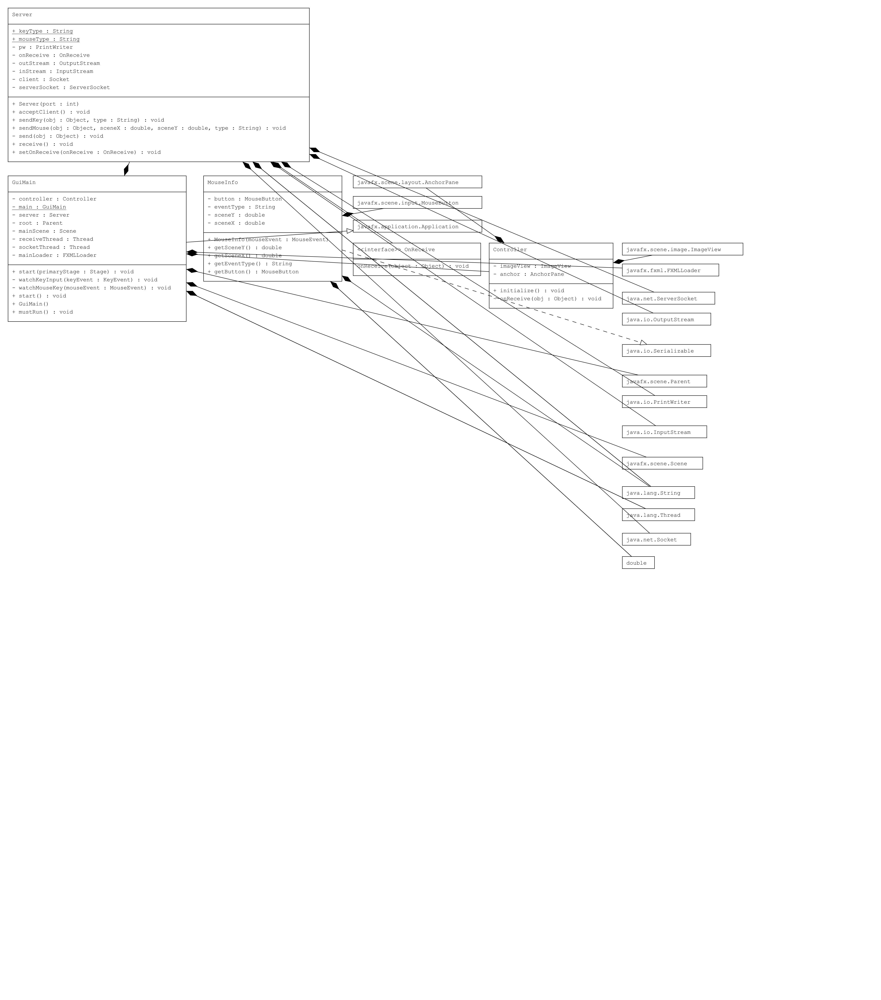
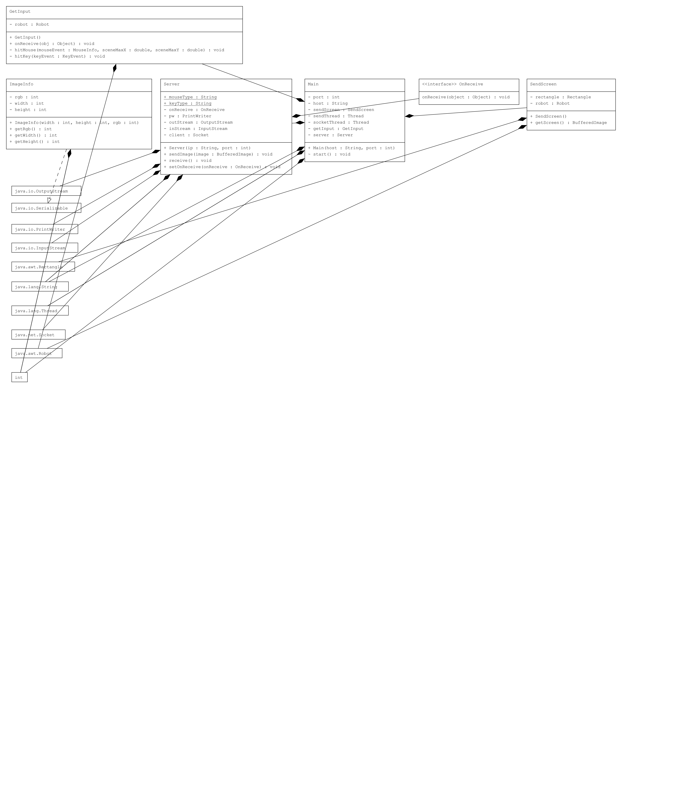
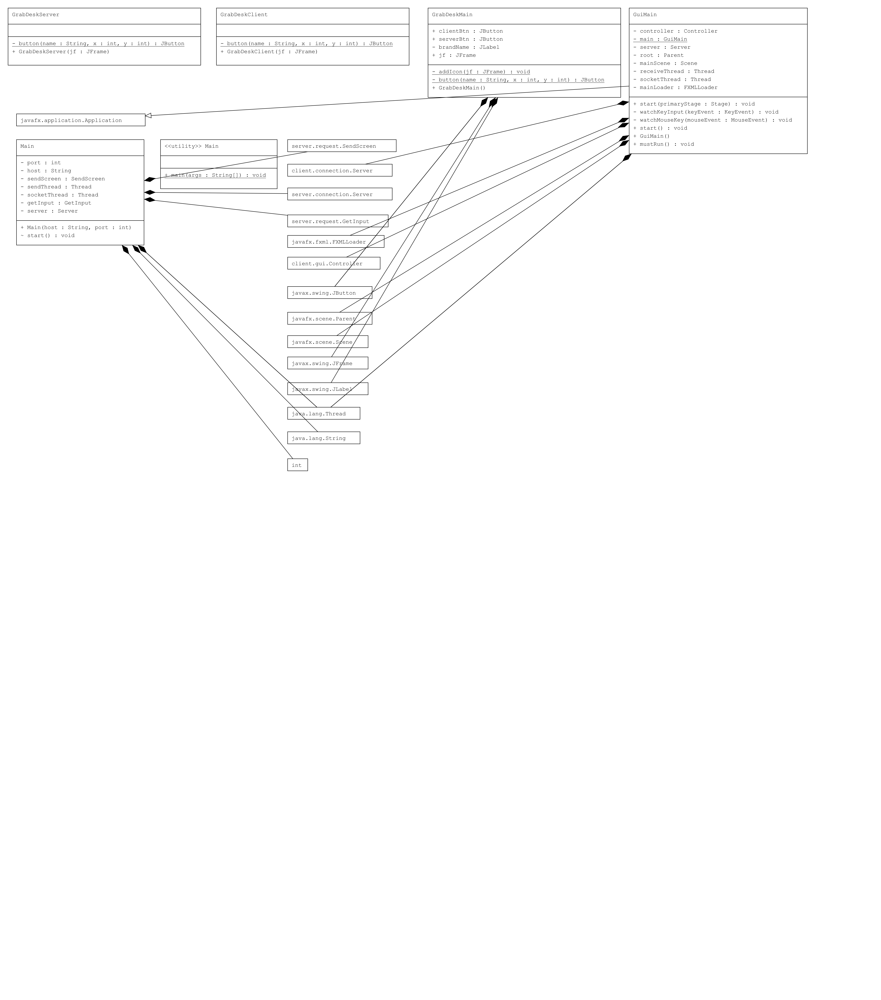
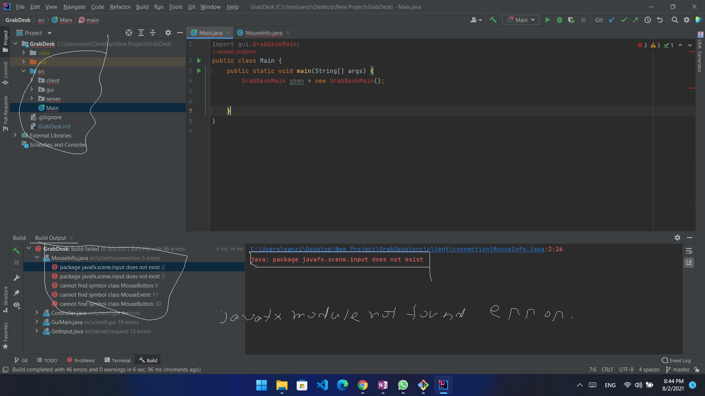
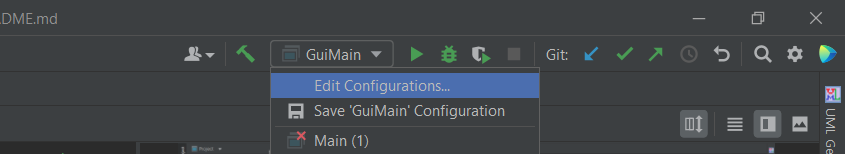
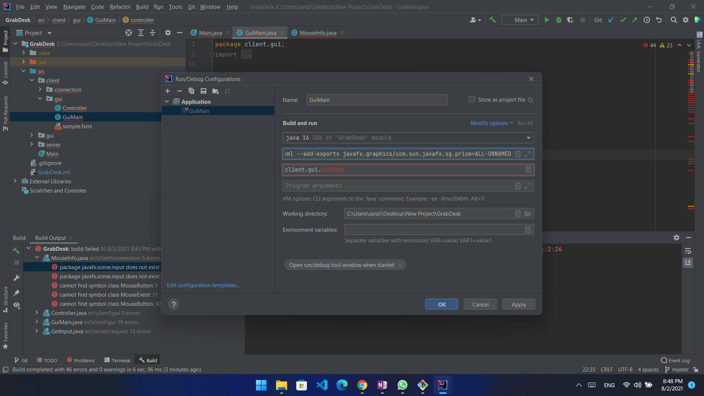
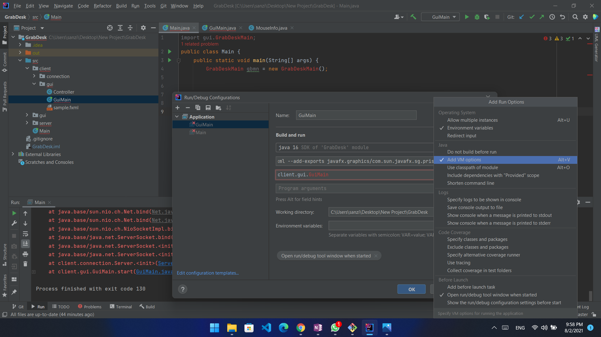
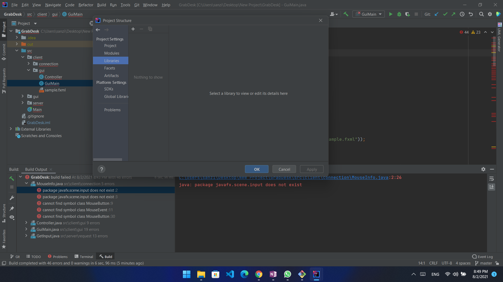
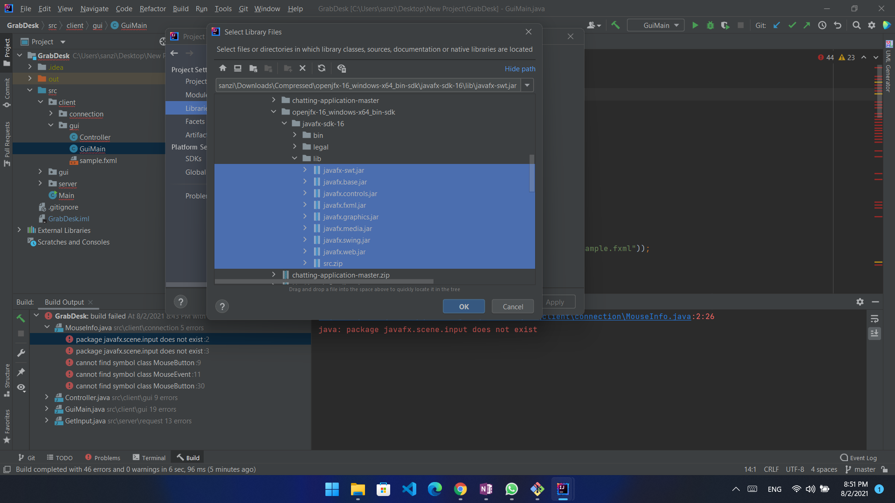

#GrabDesk Is a remote Desktop control application.

##It is an intellij project created on 2021.1.3.
###I used javafx software platform. But for **Simplify**, i also use awt Swing also,for home page design.
###The project has three package named client , server , gui.
#### Client is responsible for the controlling ```Desktop``` and the uml diagram of client package
 
##### it will open a new javafx window. and main java file is client.gui.GuiMain.java
#### Server is responsible for the being controlled ```Desktop``` and the uml diagram for client package


#### gui package is for start client.gui.GuiMain.java on a java Swing . and server.Main.java.
#####How gui package is connected with client nd server is given bellow.

--- ---
##How to Set Up the project.
####first clone the [GrabDesk project](https://github.com/sanzid-olioul/GrabDesk.git) ,
Open the project to the intellij , it will give you some errors, like this.



**This error is the javaFx module not found err, it is because javaFx in third party module**
So we have to add it on our Dependency Library. As also have to add VirtualMachine Option.

- ####Download javaFx library [click here](https://gluonhq.com/products/javafx/)
- ####Extract the file
- ####and copy the `lib` file path ie. `"C:\Users\sanzid\Downloads\Compressed\openjfx-16_windows-x64_bin-sdk\javafx-sdk-16\lib"`

###Then go to the intellij 

###then on the application select GuiMain.java ,and click on `modify option`

###then add vm option

### on the vm option past bellow text , **Give Your own path where you downloaded javafx till `lib`**

```text
--module-path
"C:\Users\sanzi\Downloads\Compressed\openjfx-16_windows-x64_bin-sdk\javafx-sdk-16\lib"
--add-modules
javafx.controls,javafx.fxml
--add-exports
javafx.graphics/com.sun.javafx.sg.prism=ALL-UNNAMED
```

--- ---
###Then Go to the ``project structure`` or just ``Ctrl+Alt+Sift+s`` .
####then go to library and click on add , select java, 

####then select all the javafx jar on the lib folder (Downloaded previously)

then apply and then again run the Main.java on the src folder.